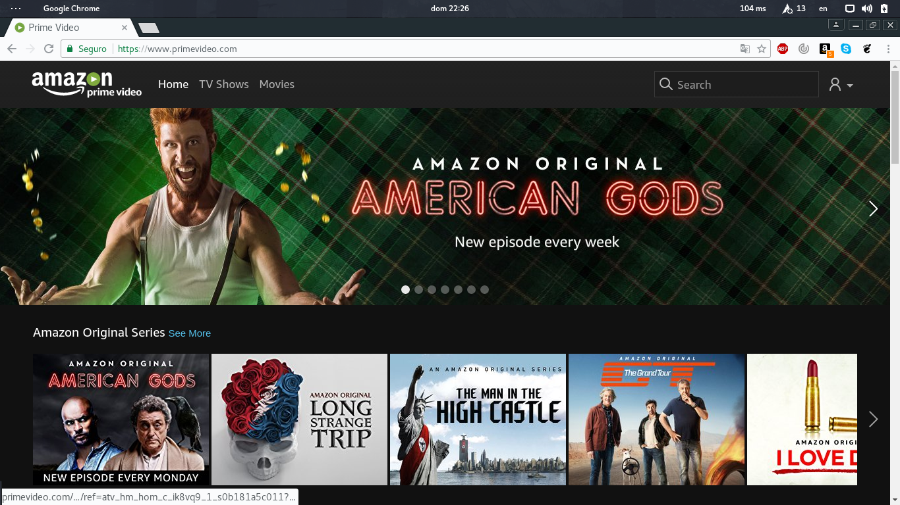

# Paseo Cognitivo a amazon Prime video

Juan Carlos Villalvazo R.

Maestria en Medios Interactivos

---
## Paseo cognitivo

amazon Prime Video
(Serie MR. ROBOT)

---

## Descripción de usuario

* Joven de 20+
* Estudiante universitario
* Fan de las series

---

## Descripción de la tarea

Un joven estudiante de mas de 20 años quiere ver MR. ROBOT, en su cuarto usado su laptop mediante amazon Prime video

---
## Información técnica

los requisitos basicos son:

* Sistema Operativo: Linux/Unix
* Conexión a internet: Videos en alta definición (HD) 3.5 Mbits/sec
* Navegadores web: Chrome (versión 58.0.3029.110)

---

## Paso 1

El joven entra a la prataforma y selecciona la categoria de TV Shows

---

## Paso 2

EL Joven selecciona la serie de su preferencia, y poner el cursor sobre el titulo seccionado se depliega la información de la serie, al darle click en el boton play se inicia el programa.

---

## Paso 3

Despues de inicar el progran y lo primero se muestran anuncios de series propias de amazon prime video

---

## Paso 4

Interfaz de la reproducción de la serie

---

## Paso 5

Esta sección es un menu al se puede acceder desde el reproductor para seleccionar una esena em particular del espisodio.

---

## Paso 6

En esta interfas se muestran los actores que partisipan en el la serie

---

## Paso 7

En Esta interfaz se muestran el nombre de los personajes que interpreta cada actor.

---

## Paso 8

Aqui se muestran las canciones que aparecierón durante el episodio

---

## Paso 10

En esta interfaz se muestran información adisionar sobre los sucedido en el episodio

