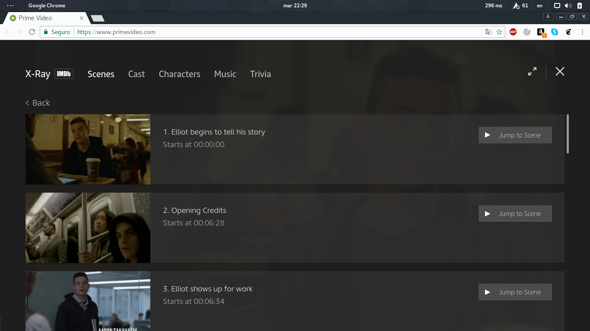

# Paseo Cognitivo a sitios on-demand

Juan Carlos Villalvazo R.

Maestria en Medios Interactivos

---
## Paseo cognitivo

amazon Prime Video
(Serie MR. ROBOT)

---
## Descripción de la tarea

Un joven estudiante de mas de 20 años quiere ver MR. ROBOT, en su cuarto usado su laptop mediante amazon Prime video

---
## Información técnica

los requisitos basicos son:

* Procesador Inter Core 2 Duo (o superior)
* Sistema Operativo: Windows, Mac OS 10.7 y superior, Linux/Unix usando Chrome
* Conexión a internet:  video en definición estandar (SD) 900 Kbits/sec, Videos en alta definición (HD) 3.5 Mbits/sec
* Navegadores web: Chrome (última versión), Firefox (última versión), Internet Explorer (versión 11 o superior), Microsoft Edge, Safari (versión 7 o superior)

---

## Descripción de usuario

* Joven de 20+
* Estudiante universitario
* Fan de las series
---

## Paso 1

El joven entra a la prataforma y selecciona la categoria de TV Shows

---

## Paso 2

EL Joven selecciona la serie de su preferencia, y poner el cursor sobre el titulo seccionado se depliega la información de la serie, al darle click en el boton play se inicia el programa.

---

## Paso 3

Despues de inicar el progran y lo primero se muestran anuncios de series propias de amazon prime video

---

## Paso 4

